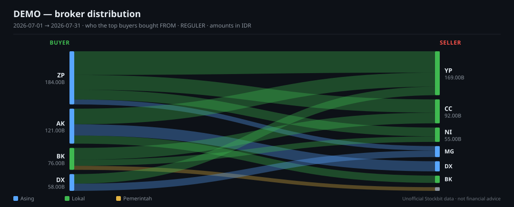

# Stockbit MCP

**Bawa Claude ke meja trading IDX Anda.**

Bandarmologi, quote, orderbook, fundamental, watchlist dan portofolio Anda — dan, hanya kalau Anda
sendiri yang menyalakannya, order entry yang wajib dikonfirmasi — lewat akun Stockbit Anda sendiri,
dari Claude Desktop, Claude Code, Cursor, atau MCP client apa pun.

[English](README.md) | Bahasa Indonesia

> [!WARNING]
> **Tidak resmi dan tidak berafiliasi.** Proyek ini tidak berafiliasi dengan, tidak didukung, dan
> tidak disponsori oleh Stockbit, PT Stockbit Sekuritas Digital, maupun Bursa Efek Indonesia. Tidak
> ada satu pun keluarannya yang merupakan nasihat investasi, dan penulisnya bukan penasihat
> berlisensi.

> [!IMPORTANT]
> **Yang Anda butuhkan.** Akun Stockbit yang Anda login sendiri dengan username dan password — login
> Google dan Facebook rusak di situs Stockbit sendiri. Node.js 22 atau lebih baru. Browser keluarga
> Chromium (Chrome, Edge, Brave, Vivaldi) untuk login sekali di awal. `broker_distribution` juga
> butuh saldo Rp 10.000.000 — itu batasan Stockbit, bukan batasan proyek ini.

> [!NOTE]
> **Data Anda tetap milik Anda.** Semuanya jalan di komputer Anda, hanya bicara ke host API Stockbit
> sendiri dengan sesi Anda, dan menyimpan refresh token di macOS Keychain (file terenkripsi di
> sistem lain). Tidak ada apa pun yang dikirim ke penulis. Satu-satunya jalur keluar dari komputer
> Anda adalah webhook alert dan bot Telegram yang Anda konfigurasi sendiri.

> [!CAUTION]
> **API tidak terdokumentasi; trading mati secara default.** Proyek ini memakai JSON API privat di
> balik aplikasi Stockbit, yang bisa berubah tanpa pemberitahuan. Akses otomatis berpotensi
> bertentangan dengan Ketentuan Penggunaan Stockbit — pakai dengan risiko Anda sendiri, di akun Anda
> sendiri. Tidak ada satu pun di sini yang bisa mengirim order sebelum Anda menjalankan
> `stockbit-auth trading-enable` sendiri, di terminal.



<sub>Aliran antar-broker, dirender oleh server ini. Data sintetis.</sub>

---

## Cara kerjanya (dan kenapa aman dijalankan)

Ini **HTTP client, bukan bot**. Tidak ada browser headless yang men-scrape halaman, tidak ada
otomasi UI Stockbit, tidak ada loop polling yang tidak Anda mulai.

- **Satu kali login interaktif, ditangkap dari browser Anda sendiri.** Anda login di halaman asli
  Stockbit; server membaca refresh token dari respons dan menyimpannya. Password Anda tidak pernah
  menyentuh kode ini.
- **Tiga domain token, tiga penyimpanan terpisah** — `exodus` (data pasar), `carina` (Stockbit
  Sekuritas), `api-sekuritas` (e-IPO). Logout dari satu tidak menyentuh yang lain.
- **Access token tidak pernah ditulis ke disk.** Hanya refresh token yang disimpan, dan ia berotasi
  setiap kali dipakai.
- **Tabel rute tertutup.** 153 bentuk request yang diizinkan di tiga host. Apa pun di luar tabel itu
  tidak bisa diminta — ada test yang memastikannya.
- **Semua log dan semua hasil tool disensor.** Token, PIN dan bot token dicocokkan berdasarkan
  bentuk, bukan hanya nama kunci.
- **Trading adalah tangga yang Anda naiki sengaja**: `off` → `--paper` → `--live`. Environment hanya
  bisa **menurunkan** posisi Anda di tangga itu, tidak pernah menaikkan.

## Yang TIDAK dilakukan

- **Tidak ada tool yang menyentuh PIN.** PIN 6 digit diketik di terminal Anda, dipakai untuk satu
  request, dan tidak pernah disimpan. Kalau ada yang meminta PIN lewat asisten, itu bukan ini.
- **Tidak ada order tanpa tiket dan konfirmasi Anda.** Tool tulis hanya menerima id tiket — tanpa
  harga, tanpa jumlah — jadi yang sampai ke bursa persis yang Anda lihat.
- **Tidak pernah mengirim ulang otomatis, tidak pernah membatalkan otomatis.** Kalau hasil sebuah
  order tidak pasti, server mengatakannya dan berhenti.
- **Resep workflow tidak bisa menulis apa pun.** Dijamin oleh konstruksi kode, bukan oleh disiplin.
- **Tidak ada rute di luar tabel** — tidak ada penarikan dana, setoran, atau posting ke stream.
- **Tidak ada scraping.** Browser Anda dipakai untuk dua hal saja: login sekali, dan menggambar di
  chart Anda sendiri.
- **Tidak ada short selling** dan **tidak ada nasihat keuangan**.

## Prasyarat

| | |
|---|---|
| **Akun Stockbit** | Username dan password. Login Google/Facebook rusak di sisi Stockbit. |
| **Node.js** | 22 atau lebih baru. |
| **Browser** | Keluarga Chromium untuk login sekali. Atau impor HAR dari browser apa pun. |
| **Rp 10.000.000** | Hanya untuk `broker_distribution`. Sisanya jalan tanpa itu. |

## Instalasi

**Claude Code**

```bash
claude mcp add --scope user stockbit -- npx -y stockbit-mcp
```

**Claude Desktop** — `claude_desktop_config.json`:

```json
{ "mcpServers": { "stockbit": { "command": "npx", "args": ["-y", "stockbit-mcp"] } } }
```

Di Windows, npx butuh shell:

```json
{ "mcpServers": { "stockbit": { "command": "cmd", "args": ["/c", "npx", "-y", "stockbit-mcp"] } } }
```

**Cursor / VS Code** — batas tool-nya 40 dan 128, sedangkan di sini ada 138. Pakai profil `core`:

```json
{ "env": { "STOCKBIT_TOOLS": "core" } }
```

Instalasi lengkap untuk setiap client, termasuk Desktop Extension dan plugin Claude Code, ada di
[README bahasa Inggris](README.md#installation).

## Mulai cepat

1. **Instal** — salah satu cara di atas.
2. **Login, sekali saja.** Bilang *"log me into Stockbit"* lalu login di jendela browser yang
   terbuka. Atau di terminal: `npx -y -p stockbit-mcp stockbit-auth login`.
3. **Restart client** Anda supaya tool-nya terbaca.
4. **Tanya: *"Is my Stockbit MCP working?"*** — Claude memanggil **`status`**: versi, sesi mana yang
   ada (tidak pernah token-nya), mode trading, posisi jam bursa dalam WIB, dan satu perintah
   berikutnya kalau ada yang kurang.
5. **Opsional — latihan dulu.** `stockbit-auth trading-enable --paper`, lalu *"beli 1 lot BBRI di
   akun paper"*. Tanpa uang sungguhan, tanpa PIN, protokolnya sama persis dengan yang asli.

## Contoh perintah

> "analisis BBRI"
> "siapa yang akumulasi GOTO bulan Juli"
> "distribusi broker BRMS"
> "technicals BBRI"
> "chart BBRI pakai bollinger bands dan panel MACD"
> "buatkan Pine untuk BBRI dengan alert golden cross"
> "buatkan alert kalau RSI BBRI di bawah 30"
> "deep dive BBRI"
> "jalankan morning scan"
> "gambarkan support dan resistance di chart BBRI"
> "saham watchlist mana yang kemarin diakumulasi broker"
> "hitung ukuran posisi BBRI: entry 4100, stop 3900, risiko 1% dari Rp 50 juta"

## Model keamanan

**Saklarnya.** Trading `off` sampai Anda sendiri menjalankan `stockbit-auth trading-enable --paper`
atau `--live`. `trading-enable` tanpa flag ditolak — dua pilihan itu berbeda sama sekali.
`STOCKBIT_TRADING` hanya bisa **menurunkan** mode; tidak ada nilainya yang menyalakan apa pun.

**PIN-nya.** Diketik di terminal Anda, dipakai satu request, tidak pernah disimpan. Tidak ada MCP
tool yang menerimanya.

**Protokol tiket.** `order_preview` menghitung dan memeriksa order lalu mengembalikan `summary` yang
Anda baca. Tool tulis hanya menerima id tiket itu dan konfirmasi. Tiket kedaluwarsa dalam dua menit
dan membawa fingerprint yang diperiksa ulang sebelum request dikirim.

**Hasilnya.** Setelah menulis, `outcome` punya tujuh kelas dan hanya `ok` yang berarti order benar
ada di papan dan terlihat di sana. Selain itu: **jangan kirim ulang**. Mengirim ulang adalah
bagaimana satu niat menjadi dua order.

**Audit.** Setiap percobaan order dan setiap perubahan akun menambah satu baris ke log, tersensor,
apa pun hasilnya — dan kalau baris itu gagal ditulis, hasilnya mengatakan demikian.

Detail lengkap: [`docs/trading.md`](docs/trading.md) dan [`SECURITY.md`](SECURITY.md).

## Status verifikasi

Setiap tool membawa satu dari tiga kata:

- **Observed** — respons asli dari akun sungguhan pernah dilihat, dan kodenya ditulis berdasarkan
  itu.
- **Read-back** — penulisan yang efeknya diverifikasi dengan membaca ulang akun setelahnya. Bentuk
  request-nya mungkin masih tebakan, tapi tebakan yang salah muncul sebagai `not-visible`, bukan
  sebagai keberhasilan palsu.
- **Projected** — nama field diambil dari bundle web Stockbit, belum pernah dilihat pada respons
  sungguhan. Field yang tidak ada berarti "tidak dikenali", bukan nol.

**Projected bukan berarti rusak.** Artinya belum ada yang memeriksanya, dan kodenya ditulis supaya
tebakan yang belum diperiksa gagal dengan berisik, bukan diam-diam.

Keluarga **trading dan e-IPO belum pernah diamati secara langsung**. Rinciannya per keluarga ada di
[`docs/VERIFICATION.md`](docs/VERIFICATION.md).

## Referensi tool

138 tool dalam 17 keluarga. Referensi lengkapnya di [`docs/TOOLS.md`](docs/TOOLS.md) (dalam bahasa
Inggris, dan dibuat otomatis dari server sehingga tidak bisa basi).

## Penafian

Perangkat lunak ini untuk **penggunaan pribadi, edukasi dan riset**.

**Tidak berafiliasi dengan, tidak didukung, dan tidak disponsori oleh** Stockbit, PT Stockbit
Sekuritas Digital, maupun Bursa Efek Indonesia. Ketentuan Penggunaan Stockbit membatasi akses
otomatis ke layanan mereka, dan memakai perangkat lunak ini berpotensi bertentangan dengan ketentuan
itu; **penangguhan akun adalah konsekuensi yang mungkin terjadi** dan itu risiko Anda. API yang
dipakainya tidak terdokumentasi dan bisa berubah atau rusak kapan saja tanpa pemberitahuan.

**Tidak ada satu pun keluarannya yang merupakan nasihat investasi.** Penulisnya bukan penasihat
investasi berlisensi dan tidak terdaftar di OJK. Indikator, backtest, deteksi pola dan pembacaan
aliran broker adalah perhitungan atas data historis, bukan ramalan. Hasil backtest tidak
memprediksi imbal hasil di masa depan.

**Kalau Anda menyalakan live trading, perangkat lunak ini bisa mengirim order sungguhan yang
membelanjakan uang sungguhan.** Fitur itu mati secara default, setiap order butuh konfirmasi
eksplisit dari Anda, dan Anda sepenuhnya bertanggung jawab atas setiap order yang dikirim
lewatnya — termasuk order yang dikirim karena Anda mengkonfirmasi sesuatu yang belum Anda baca.

Anda bertanggung jawab mematuhi ketentuan Stockbit, aturan IDX, dan hukum Indonesia.

Disediakan di bawah lisensi MIT, **tanpa jaminan apa pun**.

## Lisensi

[MIT](LICENSE) © Marvel Harisson
