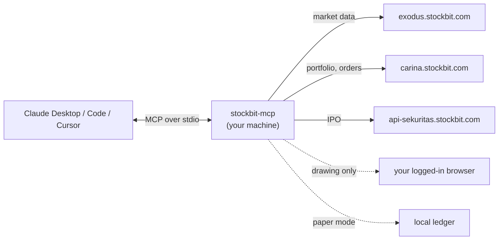
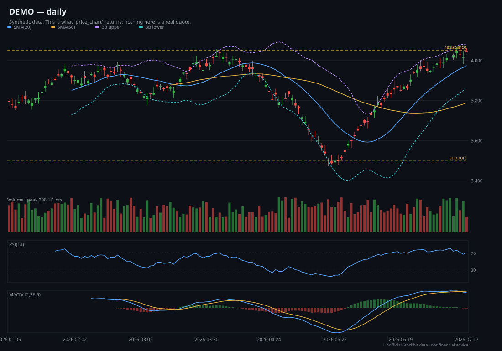

# Stockbit MCP

**Bring Claude to your IDX trading desk.**

Accepting donations: [Saweria Link](https://saweria.co/GUBS)

Bandarmology, quotes, orderbook, fundamentals, your watchlists and portfolio — and, only if you
switch it on, confirm-gated order entry — through your own Stockbit account, from Claude Desktop,
Claude Code, Cursor or any MCP client.

[](https://www.npmjs.com/package/stockbit-mcp)
[](https://github.com/INo-xious/stockbit-mcp/actions/workflows/ci.yml)
[](https://nodejs.org)
[](LICENSE)

English | [Bahasa Indonesia](README.id.md)

> [!WARNING]
> **Unofficial and unaffiliated.** This project is not affiliated with, endorsed by or supported by
> Stockbit, PT Stockbit Sekuritas Digital or the Indonesia Stock Exchange. Nothing it produces is
> investment advice, and the author is not a licensed adviser.

> [!IMPORTANT]
> **What you need.** A Stockbit account you log into yourself with a username and password — Google
> and Facebook sign-in are broken on Stockbit's own site. Node.js 22 or newer. A Chromium-family
> browser (Chrome, Edge, Brave, Vivaldi) for the one-time login. `broker_distribution` additionally
> needs a Rp 10,000,000 balance, which is Stockbit's gate, not this project's.

> [!NOTE]
> **Your data stays with you.** This runs on your machine, talks only to Stockbit's own API hosts
> with your own session, and keeps the refresh token in the macOS Keychain (an encrypted file
> elsewhere). Nothing is sent to the author. The only channels that leave your machine are the alert
> webhook and Telegram bot you configure yourself.

> [!CAUTION]
> **Undocumented API; trading off by default.** This uses the private JSON API behind Stockbit's own
> apps, which can change without notice. Automated access may conflict with Stockbit's Terms of Use
> — use it at your own risk, on your own account. Nothing here can place an order until you run
> `stockbit-auth trading-enable` yourself, at a terminal.


<sub>Broker-to-broker flow, rendered by the server. Synthetic data.</sub>

---

## How it works (and why it is safe to run)

It is an **HTTP client, not a bot.** Every number it reports comes from a JSON endpoint in a closed
route table — no headless browser scraping pages, no reading data off Stockbit's UI, no polling loop
you did not start.

- **One interactive login, captured from your own browser.** You sign in on Stockbit's real page;
  the server reads the refresh token out of the response and stores it. Your password never touches
  this code.
- **Three token domains, three separate stores.** `exodus` (market data), `carina` (Stockbit
  Sekuritas), `api-sekuritas` (e-IPO). Logging out of one leaves the others alone, and the route
  table decides which credential each request may carry.
- **The 24-hour access token is cached on disk, encrypted, and shared between processes.** Because
  the refresh token rotates on every use, N clients each minting their own access token retire each
  other's credential. Same AES-256-GCM and mode `0600` as the file-backend refresh token — which on
  macOS is a genuine reduction, since there the refresh token is in the Keychain and this is not.
  `STOCKBIT_NO_ACCESS_CACHE=1` turns it off. See [SECURITY.md](SECURITY.md).
- **A closed route table.** 153 permitted request shapes across three hosts, enumerated in
  `src/http/routes/`. Anything not in that table cannot be requested — `test/transport.test.ts`
  asserts it, and every one of the 32 non-GET routes is admitted by a named decision record.
- **Every log and every tool result is redacted.** Tokens, PINs and bot tokens are matched by shape
  as well as by key name.
- **A rate limit that behaves like a person.** Three concurrent requests, 150 ms apart.
- **Trading is a ladder you climb deliberately**: `off` → `stockbit-auth trading-enable --paper` →
  `--live`. The environment can only move you *down* it. Orders are two steps with a human in the
  middle, and where your client supports elicitation **you are asked directly, and your answer
  decides it** — a model cannot skip that ask by asserting you already agreed.



## What this tool does not do

- **No PIN handling by any tool.** The six-digit trading PIN is typed at your terminal, used for one
  request and never stored. If anything asks you for it through an assistant, that is not this.
- **No order without a ticket.** By default, the write tools also need your confirmation. The only
  exception is capped `--auto-confirm`, which you must deliberately enable for live trading at a
  terminal; a model cannot enable it or widen its value cap. The tools take no price or quantity, so
  what reaches the exchange is exactly what the ticket described.
- **No auto-resend, no auto-cancel.** When an order's outcome is uncertain the server says so and
  stops. A resend is how one intention becomes two orders.
- **Saved workflow recipes cannot write.** Enforced by construction: a write tool is never added to
  the map recipes look names up in.
- **No route outside the table.** No day-trade or smart orders, no withdrawals, no deposits, no
  posting to the stream.
- **No scraping, and no UI automation for data.** Your own browser is used for three things and
  nothing else: the one-time login, drawing on your own chart, and opening Stockbit when you ask to
  look at it. Nothing is ever read out of the page.
- **Nothing leaves your machine** except to Stockbit, and to channels you configured.
- **No short selling** — IDX retail has none — and **no financial advice**.

## Prerequisites

| | |
|---|---|
| **Stockbit account** | Username and password. Google/Facebook sign-in is broken upstream. |
| **Node.js** | 22 or newer. (`src/auth/cdp.ts` needs a global `WebSocket`.) |
| **A browser** | Chromium-family for the one-time login. Or import a HAR from any browser. |
| **macOS** | The Keychain prompts once when the token is stored. |
| **Windows** | Run the login in a terminal, or use the `login` tool from your client. |
| **Linux** | `notify-send` for desktop alerts; the encrypted file store is used instead of a keychain. |
| **Rp 10,000,000** | Only for `broker_distribution`. Stockbit's gate. Everything else works without it. |

## What it does

**Bandarmology.** `broker_summary`, `broker_distribution`, `broker_activity`, `bandar_detector` —
who accumulated, who distributed, and who was on the other side of the tape. NET and GROSS, all four
market boards, ten period windows including year-to-date in a single request. This is the data no
other market API has, and it is why this project exists.

**Market, company and fundamentals.** Quotes, full orderbook depth, auto-rejection bands, movers,
daily bars, seasonality, key statistics, ratios, financial statements, ownership, insider activity,
corporate actions, analyst ratings and peer comparison.

**One analysis engine.** Indicators, 16 candlestick patterns, multi-timeframe alignment, 9 strategy
presets, backtests with walk-forward validation, universe scans, and TradingView Pine generation —
all over the same series grammar, so the Pine you paste into TradingView fires on the condition that
was actually measured.

**Your account.** Watchlists and saved screens, read and edited, with every write verified by
reading the account back.

**Your chart.** Read and draw on your real Stockbit chart, in your own logged-in browser.

**Automation.** Eight workflows, also offered as MCP prompts. An alert daemon that keeps watching
while no client is open, delivering to a log, a desktop notification, a webhook and Telegram.



<sub>What `price_chart` returns. Synthetic data.</sub>

### Why not a TradingView MCP?

| | TradingView | Stockbit MCP |
|---|---|---|
| IDX broker-level flow | none | the core of it |
| Data access | drives a chart GUI | a JSON API, read directly |
| Your portfolio | no | yes, with your own session |
| Order entry | no | yes, confirm-gated and off by default |
| Indonesian corporate data | thin | financials, ownership, corporate actions, IPO pipeline |

## Installation

**Claude Code**

```bash
claude mcp add --scope user stockbit -- npx -y stockbit-mcp
```

**Claude Desktop** — `claude_desktop_config.json`:

```json
{ "mcpServers": { "stockbit": { "command": "npx", "args": ["-y", "stockbit-mcp"] } } }
```

On Windows, npx needs a shell:

```json
{ "mcpServers": { "stockbit": { "command": "cmd", "args": ["/c", "npx", "-y", "stockbit-mcp"] } } }
```

**Claude Desktop Extension** — download the latest `stockbit-mcp-*.mcpb` from
[Releases](https://github.com/INo-xious/stockbit-mcp/releases) and double-click it.

**Cursor** — `~/.cursor/mcp.json`. Cursor stops at 40 tools and the default `core` profile is
exactly 40, so nothing extra is needed — though that leaves no room for a second MCP server, and
running one means a narrower list (`STOCKBIT_TOOLS=market,bandarmology`, say):

```json
{ "mcpServers": { "stockbit": { "command": "npx", "args": ["-y", "stockbit-mcp"] } } }
```

**VS Code** — `.vscode/mcp.json`. Its cap is 128; the default fits with room to spare:

```json
{ "servers": { "stockbit": { "type": "stdio", "command": "npx", "args": ["-y", "stockbit-mcp"] } } }
```

**Windsurf** — `~/.codeium/windsurf/mcp_config.json`, same shape as Claude Desktop.

**Codex CLI** — `~/.codex/config.toml`:

```toml
[mcp_servers.stockbit]
command = "npx"
args = ["-y", "stockbit-mcp"]
```

**Claude Code plugin** (adds six trading-desk skills):

```
/plugin marketplace add INo-xious/stockbit-mcp
/plugin install stockbit@stockbit-mcp
```

**From source**

```bash
git clone https://github.com/INo-xious/stockbit-mcp && cd stockbit-mcp
npm ci && npm run build
node dist/bin/stockbit-mcp.js
```

`npm i -g stockbit-mcp` avoids the npx cold start on every launch — at the cost of the automatic
updates described next.

## Staying up to date

Every configuration above uses `npx -y stockbit-mcp` with no version, and that is deliberate: **npx
re-resolves the newest release each time the server starts.** A new version reaches you the next time
your client launches it, with nothing to do.

That is measured, not assumed. With 1.1.0 already sitting in the npx cache, the next bare
`npx -y stockbit-mcp` ran 1.1.1.

| How you installed | Do you get new versions automatically? |
|---|---|
| `npx -y stockbit-mcp` (every config above) | **Yes** — on the next launch |
| `npm i -g stockbit-mcp` | No. Run `npm update -g stockbit-mcp` |
| Desktop Extension (`.mcpb`) | **No.** Download the new `.mcpb` from [Releases](https://github.com/INo-xious/stockbit-mcp/releases) |
| From source | No. `git pull && npm ci && npm run build` |

**If you would rather not move.** Pin a version and nothing changes under you:

```json
{ "mcpServers": { "stockbit": { "command": "npx", "args": ["-y", "stockbit-mcp@1.1.1"] } } }
```

Or take patches and minors but never a breaking change — this project follows semver, so a new major
is the only release that can break your setup:

```json
{ "mcpServers": { "stockbit": { "command": "npx", "args": ["-y", "stockbit-mcp@^1"] } } }
```

**To force a refresh right now**, without waiting for a restart:

```bash
npx -y stockbit-mcp@latest --version
```

Which version you are actually running is always answerable — ask your assistant *"is my Stockbit MCP
working?"* and `status` reports it, alongside what else is and is not set up.

## Quick start

1. **Install** — one of the above.
2. **Log in, once.** Say *"log me into Stockbit"* and sign in in the browser window that opens. Or,
   at a terminal: `npx -y -p stockbit-mcp stockbit-auth login`. No browser? `stockbit-auth
   import-har` takes a login captured in any browser; `stockbit-auth doctor` diagnoses the rest.
3. **Restart your client** so it picks up the tools.
4. **Ask: *"Is my Stockbit MCP working?"*** — Claude calls **`status`**, which reports the version,
   which sessions exist (never the tokens), the trading mode, where the IDX trading day is in WIB,
   and the single next command if anything is missing. It answers with no session at all, which is
   where everyone starts.
5. **Optional — practise first.** `npx -y -p stockbit-mcp stockbit-auth trading-enable --paper`,
   then *"buy 1 lot of BBRI on paper"*. No real money, no PIN, and the same protocol as the real
   thing.

## Example prompts

> "analyze BBRI"
> "who accumulated GOTO between 2026-07-01 and 2026-07-31"
> "broker distribution for BRMS"
> "technicals for BBRI"
> "chart BBRI with bollinger bands and a MACD panel"
> "give me Pine for BBRI with a golden cross alert"
> "alert me when BBRI's RSI drops below 30"
> "run a deep dive on BBRI"
> "do the morning scan"
> "draw the support and resistance on BBRI's chart"
> "which of my watchlist stocks had brokers accumulating yesterday"
> "size a BBRI position: entry 4100, stop 3900, risk 1% of Rp 50 million"

## How Claude knows which tool to use

| You say… | Claude uses… |
|---|---|
| "is this working?" | `status` |
| "who is accumulating BBRI?" | `broker_summary` → `broker_distribution` |
| "look at BBRI properly" | the `deep_dive` prompt, or `analyze` |
| "what moved today?" | `market_session` → `top_movers` → `technicals` |
| "has this strategy worked?" | `backtest` → `strategy_compare` (with walk-forward) |
| "scan my watchlist for oversold" | `scan` over `universe: watchlist` |
| "tell me when BBRI hits 4000" | `alert_create`, then the `stockbit-alerts` daemon |
| "draw support and resistance" | `chartbit_analyze` → `chartbit_draw` |
| "how many lots should I buy?" | `position_size` |
| "buy 2 lots of BBRI" | `trading_status` → `order_preview` → *you confirm* → `order_buy` |
| "what do I hold?" | `portfolio` → `cash_balance` |
| "what IPOs are open?" | `eipo_list` → `eipo_detail` |
| "when does BBRI pay a dividend?" | `dividend_calendar` |
| "what is the news on GOTO?" | `news` / `stream` |

## Tool reference

**138 tools in 17 families.** The full generated reference — every tool, its evidence, its arguments
— is [`docs/TOOLS.md`](docs/TOOLS.md).

| Family | Tools | When to use | Evidence |
|---|---|---|---|
| [system](docs/TOOLS.md#system) | 3 | Is this working; log in; log out | Observed |
| [market](docs/TOOLS.md#market) | 18 | Prices, depth, movers, bars, the session | Mixed |
| [bandarmology](docs/TOOLS.md#bandarmology) | 6 | Who accumulated, who distributed | Mixed |
| [analysis](docs/TOOLS.md#analysis) | 9 | Indicators, patterns, backtests, charts, sizing | Observed |
| [company](docs/TOOLS.md#company) | 9 | Profile, ownership, management, peers, ratings | Projected |
| [fundamentals](docs/TOOLS.md#fundamentals) | 10 | Key stats, ratios, statements, seasonality | Mixed |
| [insider](docs/TOOLS.md#insider) | 4 | Insider and affiliate transactions | Projected |
| [corpaction](docs/TOOLS.md#corpaction) | 7 | Dividends, splits, rights, the calendar | Projected |
| [stream](docs/TOOLS.md#stream) | 7 | Posts, news, research | Projected |
| [screener](docs/TOOLS.md#screener) | 5 | The catalogue, the presets, running a screen | Projected |
| [account](docs/TOOLS.md#account) | 11 | Your watchlists and saved screens, and editing them | Mixed |
| [chartbit](docs/TOOLS.md#chartbit) | 17 | Reading and drawing on your real chart | Observed |
| [alerts](docs/TOOLS.md#alerts) | 4 | Rules that fire while no client is open | Observed |
| [pine](docs/TOOLS.md#pine) | 1 | TradingView Pine generation | Observed |
| [workflows](docs/TOOLS.md#workflows) | 2 | Saved recipes, also offered as prompts | Observed |
| [trading](docs/TOOLS.md#trading) | 16 | Your brokerage account and order entry | Projected |
| [eipo](docs/TOOLS.md#eipo) | 9 | The IPO pipeline and subscribing | Projected |

## Verification status

Every tool carries one of three words, and they mean exactly this:

- **Observed** — a real response from a live account was seen, and the code was written against it.
- **Read-back** — a write whose effect is verified by re-reading the account afterwards. The request
  body may still be a guess, but a wrong guess shows up as `not-visible`, never as a false success.
- **Projected** — field names taken from Stockbit's web bundle, never seen on a live response.
  `readFrom` names the wire key each value came from, and an absent field means "not recognised",
  not zero.

**Projected is not a warning that something is broken.** It is a statement that nobody has checked
it, and that the code is built so an unchecked guess fails loudly rather than quietly.

The **trading and e-IPO families have never been observed live** — reading them needs a securities
session, which needs the account owner's PIN at their own terminal. Per-family detail, with dates
and what was compared against what, is in [`docs/VERIFICATION.md`](docs/VERIFICATION.md); what is
still open, and in what order it matters, is in
[`docs/PENDING-VERIFICATION.md`](docs/PENDING-VERIFICATION.md).

## Safety model

**The switches.** Trading is `off` until you run `stockbit-auth trading-enable --paper` or `--live`
yourself. A bare `trading-enable` is refused — the two differ by everything. `STOCKBIT_TRADING` can
only move the mode *down* the ladder (`live` → `paper` → `off`); no value of it turns anything on.
No module under `src/tools/`, `src/trading/` or `src/eipo/` may write the settings file, and a test
asserts that.

**The PIN.** Typed at your terminal, used for one request, never stored. No MCP tool accepts one.

**The ticket protocol.** `order_preview` prices and checks the order and returns a `summary` you
read. The write tools take that ticket id and an optional confirmation, and nothing else. A ticket
expires in two minutes and carries a fingerprint that is rechecked before the request goes out.

**Who confirms.** Where your client supports MCP elicitation, **you are asked directly, before
`confirm` is even looked at, and your answer is the decisive one** — declining refuses the order
however the model set `confirm`. Elicitation is the only channel in MCP that reaches a person;
`confirm: true` is a boolean the model sets, and treating the two as interchangeable was a real
defect here, fixed in [ADR-0010](docs/adr/0010-elicitation-is-decisive.md). On a client that cannot
elicit, `confirm: true` is the only gate there is, the order proceeds, and both the result and the
audit line say plainly that no human was asked. The model must never set `confirm` on your behalf.

You own three switches over that, all set at your own terminal and none reachable by any tool:

| | |
|---|---|
| `trading-enable --elicitation required` | Refuse rather than send when no person can be reached. `confirm: true` never substitutes. |
| `trading-enable --elicitation when-available` | Ask wherever the client can; fall back to `confirm: true` where it cannot. **The default.** |
| `trading-enable --elicitation never` | Do not ask at all. `confirm: true` is the only gate. |
| `trading-enable --auto-confirm --max-order-value N` | Waive the per-order step entirely, under a value cap. Live only, and ignored outright when `--elicitation required` contradicts it. |

The confirmation dialog also carries a second box **you** may tick: don't ask again, for fifteen
minutes, for orders worth no more than the one you just approved, under the trading policy that was
in force when you ticked it. It lives in that server's memory and never on disk — a restart ends it,
`trading_forget` ends it in that conversation, and `stockbit-auth trading-forget` ends it everywhere
including servers already running. `status` says whether one is live.

**Outcomes.** After a write, `outcome` is one of seven classes. `ok` is the only clean success;
`landed-despite-error` also means the read-back found the order, but the request itself errored.
Never resend any non-`ok` result:

| `outcome` | Meaning |
|---|---|
| `ok` | On the book, confirmed by reading the orders back. |
| `rejected` | Refused by the exchange. Not working. |
| `write-failed` | Refused before it left. Nothing was sent. |
| `not-found-after-error` | The request errored and the book read back clean. |
| `not-visible` | Accepted, but not found on the read-back. **Do not resend.** |
| `landed-despite-error` | The request errored and the order is there anyway. |
| `outcome-unknown` | The state could not be established. **Do not resend.** |

**Audit.** Every order attempt and every account edit appends a line to a log, redacted, whatever
the outcome — and if that line could not be written, the result says so rather than implying an
audit trail that does not exist.

**Credential storage.** macOS Keychain where available. Elsewhere an AES-256-GCM file whose key is
derived from hostname and username: that is **obfuscation, not a vault** — anything running as you
on your machine can derive the same key. See [`SECURITY.md`](SECURITY.md).

Decision records: [ADR-0004](docs/adr/0004-order-entry.md) (order entry),
[ADR-0007](docs/adr/0007-auth-tools-in-the-server.md) (login as a tool),
[ADR-0008](docs/adr/0008-paper-trading.md) (paper mode). Full guide:
[`docs/trading.md`](docs/trading.md).

## Paper trading

```bash
stockbit-auth trading-enable --paper          # Rp 100,000,000 to practise with
stockbit-auth paper-reset --cash 250000000
```

A local ledger, no exchange, no session, no PIN — and the identical protocol, so nothing about the
live path is a surprise later. Your portfolio, positions, cash, orders and history are served from
the ledger while it is on, and every result says `PAPER ACCOUNT — no real money.`

Fills are approximate in three specific ways, stated on every result: close-only minutely data (so
some real fills are missed), no queue position (so paper is optimistic), and no partial fills. Do
not backtest against it and believe the number.

## Tool profiles and context management

Every client pays for the whole tool list in the model's context on every turn — and that is a
**per-turn** cost, not a startup one. The full surface is around 220,000 bytes of `tools/list`,
roughly 55,000 tokens, on every single message; `core` is about a third of that.

**`core` is the default.** `STOCKBIT_TOOLS` changes it:

| Value | Effect |
|---|---|
| unset — **the default** | `core`: 40 tools and 6 prompts. The questions people actually ask. Fits Cursor's cap. No order writes. |
| `all` | All 138. Roughly 55,000 tokens of tool schemas per turn, against ~17,700 for `core`. |
| `market,bandarmology` | Those families only. |
| `core,trading` | Core plus order entry. |
| `quote,analyze` | Individual tools, mixed freely with families. |

`system` (`status`, `login`, `logout`) is never filtered out — it is how you find out why everything
else is missing. An unknown value stops the server with a message naming every family, rather than
silently loading all 138.

**Output sizes.** `analyze` makes about 27 upstream requests and returns 4–8 KB. `broker_summary`
takes a `limit`. `financials` is large. Chart tools return a base64 SVG *and* a file path. Prefer
`technicals` when you only need the numbers.

## Alerts and the daemon

An MCP server exists only while a client holds it open, so a rule that fires at 14:20 on a Tuesday
needs a separate process:

```bash
npx -y -p stockbit-mcp stockbit-alerts watch      # every 60s during IDX hours
npx -y -p stockbit-mcp stockbit-alerts check      # one pass
npx -y -p stockbit-mcp stockbit-alerts test       # exercise every channel
```

Channels: an append-only log (always, and first — a channel that fails silently is worse than none),
a desktop notification, a webhook (`STOCKBIT_ALERT_WEBHOOK`, https or localhost only), and Telegram.

For Telegram: get a token from [@BotFather](https://t.me/BotFather), message your bot once, then
read the numeric chat id from `https://api.telegram.org/bot<token>/getUpdates`. Set
`STOCKBIT_TELEGRAM_BOT_TOKEN` and `STOCKBIT_TELEGRAM_CHAT_ID` — environment only, because a token on
the command line is visible to every user on the machine through `ps`.

Keep it running with launchd (macOS), Task Scheduler (Windows) or a systemd user unit (Linux).

## CLI reference

| Command | |
|---|---|
| `stockbit-mcp` | The MCP server. Speaks stdio; your client launches it. |
| `stockbit-auth login [--fresh-profile] [--switch-account]` | One-time browser login. `--switch-account` signs the current account out of the browser profile first, so you get a real form instead of the app. |
| `stockbit-auth import-har` | Import a login captured in any browser. |
| `stockbit-auth doctor` | Diagnose browsers, the token store and the capture path. |
| `stockbit-auth bootstrap` | Paste a refresh token by hand. |
| `stockbit-auth status [--verify] [--json]` | Everything, redacted. `--json` is safe to paste into an issue. `--verify` spends one refresh to prove the token — which ROTATES it and ends your website session. |
| `stockbit-auth logout [--keep-profile]` | Clear the token and the logged-in browser profile. |
| `stockbit-auth trading-login [--browser]` | Unlock Stockbit Sekuritas with your PIN. Never stored. |
| `stockbit-auth trading-status [--offline]` | The trading policy, and whether the session works. |
| `stockbit-auth trading-enable --paper [--cash N]` | Practise mode. |
| `stockbit-auth trading-enable --live [--max-order-value N] [--max-lots N] [--symbols A,B] [--auto-confirm]` | Real orders. |
| `stockbit-auth trading-disable` | Back to off. The session and the ledger are left alone. |
| `stockbit-auth paper-reset [--cash N]` | Start the paper ledger over. |
| `stockbit-auth trading-logout` | End the trading session and delete its credential. |
| `stockbit-alerts watch\|check\|test` | The alert daemon. |

Every command answers `--help`/`-h` without running anything, and an unknown flag or stray argument
is an error naming what that command accepts — never silently ignored.

## Files it writes

Everything lives in one directory — `~/.stockbit`, or wherever `STOCKBIT_STORE_DIR` points. Nothing
is written outside it.

| Path | |
|---|---|
| `refresh.enc` | Your session token, AES-256-GCM (off macOS). |
| `settings.json` | The trading switches. Written by `stockbit-auth`, never by the server. |
| `paper/ledger.json` | The paper account. |
| `charts/`, `pine/` | Rendered charts and generated Pine. |
| `alerts.json`, `alerts.log` | Alert rules, and every alert that fired. |
| `order-mutations.log` | Every order and IPO attempt, append-only. |
| `account-mutations.log` | Every watchlist and screener edit, append-only. |
| `layout-backups/`, `layout-mutations.log` | Pre-write chart snapshots and the write log. |

## Environment variables

| Variable | Effect |
|---|---|
| `STOCKBIT_TOOLS` | `core` (**the default**), `all`, or a comma-separated list of families and tool names. |
| `STOCKBIT_STORE_DIR` | Where everything on disk lives. Default `~/.stockbit`. |
| `STOCKBIT_TRADING` | `off` forces off; `paper` lowers `live` to paper. It can only lower the mode. |
| `STOCKBIT_BROWSER` | Absolute path to the Chromium binary used for login. |
| `STOCKBIT_WEB_BROWSER` | Which browser to open Stockbit in, e.g. `"Microsoft Edge"`. |
| `STOCKBIT_NO_BROWSER=1` | Never open a browser window; `login` refuses and names the CLI. |
| `STOCKBIT_LOGIN_TIMEOUT_MS` | How long the login capture waits. |
| `STOCKBIT_ACCESS_TOKEN` | Use this bearer instead of the stored session. Memory only. |
| `STOCKBIT_FORCE_FILE_STORE=1` | Skip the Keychain and use the encrypted file store. |
| `STOCKBIT_ALERT_WEBHOOK` | https endpoint for fired alerts. |
| `STOCKBIT_TELEGRAM_BOT_TOKEN`, `STOCKBIT_TELEGRAM_CHAT_ID` | Telegram delivery. |
| `STOCKBIT_DEBUG=1` | Log response shapes on parse failures. |

## Troubleshooting

| Symptom | |
|---|---|
| `status` says no session | Log in. Say *"log me into Stockbit"* or run `stockbit-auth login`. |
| HTTP 401 after a week away | The refresh token rotates on a sliding 7-day window. Log in again. |
| Google sign-in does nothing | Broken on Stockbit's own site (deprecated `gapi.auth2`). Use username and password. |
| Cloudflare challenge on `trading-login` | `stockbit-auth trading-login --browser`. |
| A blank white Chartbit page | You are signed out in that browser. |
| `broker_distribution` errors | Stockbit's Rp 10,000,000 balance gate. |
| Empty movers | Weekend or a holiday. Check `market_session`. |
| VS Code or Cursor: "too many tools" | You have set `STOCKBIT_TOOLS=all`. Remove it — the default is `core`, which is 40. |
| Windows: `npx` ENOENT | Use `"command": "cmd", "args": ["/c", "npx", …]`. |
| Something else | `stockbit-auth doctor`, then `stockbit-auth status --json` — both are safe to paste. |

## Testing

```bash
npm ci
npm run typecheck
npm test          # the whole suite, entirely offline — fetch is stubbed, no network, no skips
npm run build
npm run smoke     # starts the built binary over stdio and asks it what it registered
npm run check:pack
```

CI runs all of that on Ubuntu, macOS and Windows against Node 22 and 24, plus a dependency audit, an
offline link check, and `npm run docs:tools && git diff --exit-code docs/TOOLS.md`.

## Architecture

```
bin/         three entry points: the MCP server, auth, the alert daemon
src/
  http/      the closed route table and the transport that enforces it
  auth/      login capture, the three token stores, refresh with a cross-process lock
  core/      one module per Stockbit domain — the readers everything else is built on
  analysis/  indicators, patterns, strategies, backtests, scans, position sizing
  render/    pure SVG: candles, flow diagrams. No browser.
  tools/     MCP registration, one module per family
  trading/   tickets, previews, order submission, the paper ledger
  eipo/      the IPO pipeline
  alerts/    rules, the daemon, delivery
  workflows/ the eight built-in recipes
```

Three invariants, each enforced by a test rather than a convention:

1. **Nothing can reach a Stockbit host outside the route table** (`test/transport.test.ts`).
2. **A write tool is never reachable from a saved workflow recipe** — `define.write` does not add to
   the handler map (`test/tools.test.ts`).
3. **Nothing that serves a model can write the settings file** (`test/settings.test.ts`).

## Roadmap

A trade journal; rasterising charts to PNG for vision models; Windows DPAPI and Linux libsecret
credential stores; CSV export; a `stockbit run <tool>` CLI. After that: converting the carina and
e-IPO families from Projected to Observed, which takes one live session and is the account owner's
call.

## Contributing · Security

[`CONTRIBUTING.md`](CONTRIBUTING.md) · [`SECURITY.md`](SECURITY.md) ·
[`CODE_OF_CONDUCT.md`](CODE_OF_CONDUCT.md) · [`CONTEXT.md`](CONTEXT.md) (the vocabulary) ·
[`docs/README.md`](docs/README.md) (the index).

Longer than this page: the [**user guide**](docs/FEATURES.md) walks through every feature and what to
ask for; [`docs/TOOLS.md`](docs/TOOLS.md) is the generated reference; [`docs/adr/`](docs/adr/README.md)
records every decision that changed what this server may do.

Please report vulnerabilities privately through GitHub Security Advisories, not a public issue.

## Acknowledgements

**[Garit32](https://github.com/Garit32)** — collaborator, and the author of most of the commits on
this project's history, including the Windows login capture and browser detection.

[`tradesdontlie/tradingview-mcp`](https://github.com/tradesdontlie/tradingview-mcp) — the polish
this README was measured against. Stockbit's chart page is built on TradingView's charting library,
which is why Chartbit works the way it does.

## Disclaimer

This software is for **personal, educational and research use**.

It is **not affiliated with, endorsed by or supported by** Stockbit, PT Stockbit Sekuritas Digital,
or the Indonesia Stock Exchange. Stockbit's Terms of Use restrict automated access to their
services, and using this software may conflict with them; **account suspension is a possible
consequence** and it is yours to weigh. The API it uses is undocumented and can change or break at
any time without notice.

**Nothing this software produces is investment advice.** The author is not a licensed investment
adviser and is not registered with OJK. Indicators, backtests, pattern detections and broker-flow
readings are computations over historical data, not predictions. Backtested results do not predict
future returns.

**If you enable live trading, this software can send real orders that spend real money.** It is off
by default. Orders require your explicit confirmation unless you separately opt into capped
`--auto-confirm`; you remain solely responsible for every order placed through it, including orders
within a cap you authorised in advance.

You are responsible for complying with Stockbit's terms, IDX rules, and Indonesian law.

Provided under the MIT licence, **without warranty of any kind**.

## License

[MIT](LICENSE) © Marvel Harisson
